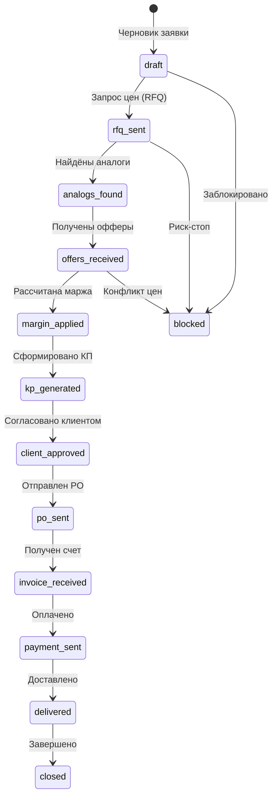

# 🎨 Аудит и отчет по всему UI/UX Фронтенду проекта PartsOps AI Manager

> **Дата проведения аудита:** 28 июля 2026 г.  
> **Статус проверки TypeScript:** `0 ошибок` (пройдено успешно для всех фронтенд-модулей)  
> **Охват аудита:** `Admin Cockpit`, `Client Portal`, `Agent OS Devpack Console`, `UI Specs` и связанные Backend-эндпоинты REST API.

---

## 1. Архитектурная карта фронтенд-модулей (Frontend Application Map)

В проекте реализована трехуровневая фронтенд-экосистема для работы операторов закупок, клиентов и контроля AI-агентов.

| Модуль фронтенда | Назначение | Технологический стек | Основной каталог |
| :--- | :--- | :--- | :--- |
| **Admin Cockpit** | Главная панель управления закупками, OEM-подбором, наценкой, счетами и AI-оркестрацией | React 19.2.7, TypeScript 6.0, Vite 8.1, Tailwind CSS 3.4, FontAwesome 7.3, Playwright | [`partsops-ai-manager/06_UI/admin_cockpit`](file:///Users/user/projects/Danila%20master/partsops-ai-manager/06_UI/admin_cockpit) |
| **Client Portal** | Портал согласования коммерческих предложений (КП) и онлайн-трекинга заказов клиентами | React 17.0.0, React Router DOM 6.30, Vite | [`partsops-ai-manager/06_UI/client_portal`](file:///Users/user/projects/Danila%20master/partsops-ai-manager/06_UI/client_portal) |
| **Agent OS Console** | Консоль мониторинга и отладки мультиагентных нейросетевых пайплайнов (Devpack) | React 19, Lucide Icons, Vite, Custom CSS | [`partsops_agent_os_devpack/05_FRONTEND`](file:///Users/user/projects/Danila%20master/partsops_agent_os_devpack/05_FRONTEND) |
| **UI Specs & Schema** | Архитектурные спецификации UI-компонентов и интерфейсная карта | YAML / Markdown спецификации | [`partsops_agent_os_devpack/03_UI_SPEC`](file:///Users/user/projects/Danila%20master/partsops_agent_os_devpack/03_UI_SPEC) |

---

## 2. Схема бизнес-логики и Workflow состояний

### 2.1 Жизненный цикл заявки на закупку (Workflow State Machine)

Вся логика фронтенд-интерфейса жестко синхронизирована с конечным автоматом состояний. В модуле [`stateMachine.ts`](file:///Users/user/projects/Danila%20master/partsops-ai-manager/06_UI/admin_cockpit/src/lib/stateMachine.ts) определены 13 состояний и допустимые переходы:



- **Клиентский TS-контроллер:** [`stateMachine.ts`](file:///Users/user/projects/Danila%20master/partsops-ai-manager/06_UI/admin_cockpit/src/lib/stateMachine.ts)
- **Бэкенд-контроллер:** [`state_machine.py`](file:///Users/user/projects/Danila%20master/partsops-ai-manager/state_machine.py)

---

### 2.2 Ролевая модель доступа (RBAC Logic)

В интерфейсе [`rbac.ts`](file:///Users/user/projects/Danila%20master/partsops-ai-manager/06_UI/admin_cockpit/src/lib/rbac.ts) реализовано разграничение видимости элементов и действий по 5 ролям:

1. **`ADMIN`**: Полный доступ ко всем функциям, принудительный сброс состояний, утверждение счетов выше целевого лимита.
2. **`PROCUREMENT_MANAGER`**: Ведение заявок, выбор аналогов, расчет наценок, отправка КП клиенту.
3. **`ANALYST`**: Просмотр аналитики, расходов на LLM, истории заказов и дашборда уверенности.
4. **`AUDITOR`**: Просмотр Audit Timeline, реестра счетов, верификация Evidence Gates.
5. **`VIEW_ONLY`**: Только чтение без прав изменения состояний и вызова API-действий.

---

### 2.3 Интерактивные UX-подсистемы

1. **Hermes Chat Drawer (AI Copilot)**  
   - Исходник: [`HermesChatDrawer.tsx`](file:///Users/user/projects/Danila%20master/partsops-ai-manager/06_UI/admin_cockpit/src/components/HermesChatDrawer.tsx)  
   - **Логика:** Выдвижная панель справа для общения с AI-ассистентом Hermes. Поддерживает потоковый вывод ответов (SSE/streaming), быстрые промпты («Анализ рисков», «Проверка OEM», «Оптимизация доставки»), отображение статуса инструментарии и автоматическое PII-маскирование.

2. **Command Palette (`Cmd+K` / `Ctrl+K`)**  
   - Исходник: [`CommandPalette.tsx`](file:///Users/user/projects/Danila%20master/partsops-ai-manager/06_UI/admin_cockpit/src/components/CommandPalette.tsx)  
   - **Логика:** Глобальная модалка мгновенного поиска по заявкам, поставщикам и разделам. Оборудована Focus Trap (`focus.ts`) и горячими клавишами навигации.

3. **Batch Search Modal (Пакетный поиск OEM)**  
   - Исходник: [`BatchSearchModal.tsx`](file:///Users/user/projects/Danila%20master/partsops-ai-manager/06_UI/admin_cockpit/src/components/BatchSearchModal.tsx)  
   - **Логика:** Форма загрузки списка артикулов списком/CSV с валидацией строк и запуском параллельного поиска через бэкенд.

4. **Multi-Agent Orchestra View & Pipeline Monitor**  
   - Исходники: [`MultiAgentOrchestraView.tsx`](file:///Users/user/projects/Danila%20master/partsops-ai-manager/06_UI/admin_cockpit/src/components/MultiAgentOrchestraView.tsx) & [`PipelineMonitor.tsx`](file:///Users/user/projects/Danila%20master/partsops-ai-manager/06_UI/admin_cockpit/src/components/PipelineMonitor.tsx)  
   - **Логика:** Мониторинг выполнения задач агентами (Matcher Agent, Pricing Agent, Risk Guard Agent, ERP Sync Agent) с живыми статусами.

5. **Invoices Registry & Invoice Preview**  
   - Исходники: [`InvoicesRegistry.tsx`](file:///Users/user/projects/Danila%20master/partsops-ai-manager/06_UI/admin_cockpit/src/components/InvoicesRegistry.tsx) & [`InvoicePreview.tsx`](file:///Users/user/projects/Danila%20master/partsops-ai-manager/06_UI/admin_cockpit/src/components/InvoicePreview.tsx)  
   - **Логика:** Реестр входящих счетов от поставщиков, проверка юр.лиц, сравнение сумм с расчетом и интерактивный просмотр счетов.

---

## 3. Детальный реестр UI-компонентов Admin Cockpit

Ниже приведена таблица всех 33 компонентов `Admin Cockpit` с прямыми ссылками на код:

| Компонент | Исходный файл | Строк / Байт | UX-назначение и Логика |
| :--- | :--- | :--- | :--- |
| **Primitives** | [`Primitives.tsx`](file:///Users/user/projects/Danila%20master/partsops-ai-manager/06_UI/admin_cockpit/src/components/Primitives.tsx) | 39.4 КБ | Базовая библиотека атомарных элементов (AppFrame, TopCommandBar, LeftNavRail, SectionCard, MetricTile, ActionButton, InlineAlert, EmptyState) |
| **App Main** | [`App.tsx`](file:///Users/user/projects/Danila%20master/partsops-ai-manager/06_UI/admin_cockpit/src/App.tsx) | 805 л. / 40.8 КБ | Оркестратор главного экрана, маршрутизация вкладок, подгрузка заявок, связывание подсистем |
| **HermesChatDrawer** | [`HermesChatDrawer.tsx`](file:///Users/user/projects/Danila%20master/partsops-ai-manager/06_UI/admin_cockpit/src/components/HermesChatDrawer.tsx) | 21.1 КБ | AI Copilot диалог с трансляцией контекста заявки |
| **CommandPalette** | [`CommandPalette.tsx`](file:///Users/user/projects/Danila%20master/partsops-ai-manager/06_UI/admin_cockpit/src/components/CommandPalette.tsx) | 12.0 КБ | Быстрый поиск `Cmd+K` с клавиатурным управлением |
| **ContractControlPanel** | [`ContractControlPanel.tsx`](file:///Users/user/projects/Danila%20master/partsops-ai-manager/06_UI/admin_cockpit/src/components/ContractControlPanel.tsx) | 24.0 КБ | Панель контроля условий контрактов, лимитов задолженности и пени |
| **InvoicesRegistry** | [`InvoicesRegistry.tsx`](file:///Users/user/projects/Danila%20master/partsops-ai-manager/06_UI/admin_cockpit/src/components/InvoicesRegistry.tsx) | 20.8 КБ | Реестр счетов поставщиков с фильтрацией и статусами оплаты |
| **PipelineMonitor** | [`PipelineMonitor.tsx`](file:///Users/user/projects/Danila%20master/partsops-ai-manager/06_UI/admin_cockpit/src/components/PipelineMonitor.tsx) | 21.2 КБ | Визуализатор очереди конвейера обработки заказов |
| **MultiAgentOrchestraView** | [`MultiAgentOrchestraView.tsx`](file:///Users/user/projects/Danila%20master/partsops-ai-manager/06_UI/admin_cockpit/src/components/MultiAgentOrchestraView.tsx) | 20.4 КБ | Панель статусов и логов работы мультиагентной системы |
| **RightPanel** | [`RightPanel.tsx`](file:///Users/user/projects/Danila%20master/partsops-ai-manager/06_UI/admin_cockpit/src/components/RightPanel.tsx) | 21.9 КБ | Контекстная правая панель с подробностями выбранной заявки |
| **SupplierDetailPage** | [`SupplierDetailPage.tsx`](file:///Users/user/projects/Danila%20master/partsops-ai-manager/06_UI/admin_cockpit/src/components/SupplierDetailPage.tsx) | 75.7 КБ | Карточка детальной информации о поставщике, рейтинге и прайс-листах |
| **SuppliersPage** | [`SuppliersPage.tsx`](file:///Users/user/projects/Danila%20master/partsops-ai-manager/06_UI/admin_cockpit/src/components/SuppliersPage.tsx) | 28.7 КБ | Сводный список поставщиков с поиском и фильтрацией |
| **SupplierMatrix** | [`SupplierMatrix.tsx`](file:///Users/user/projects/Danila%20master/partsops-ai-manager/06_UI/admin_cockpit/src/components/SupplierMatrix.tsx) | 15.0 КБ | Таблица сопоставления цен и сроков поставщиков по OEM |
| **PricingCalculator** | [`PricingCalculator.tsx`](file:///Users/user/projects/Danila%20master/partsops-ai-manager/06_UI/admin_cockpit/src/components/PricingCalculator.tsx) | 12.0 КБ | Интерактивный калькулятор наценок, скидок и целевой маржи |
| **JobReportView** | [`JobReportView.tsx`](file:///Users/user/projects/Danila%20master/partsops-ai-manager/06_UI/admin_cockpit/src/components/JobReportView.tsx) | 12.3 КБ | Просмотр отчетов по фоновым задачам и импорту |
| **AuditTimeline** | [`AuditTimeline.tsx`](file:///Users/user/projects/Danila%20master/partsops-ai-manager/06_UI/admin_cockpit/src/components/AuditTimeline.tsx) | 11.3 КБ | Временная шкала всех действий пользователей и агентов |
| **CompletedOrdersHistory** | [`CompletedOrdersHistory.tsx`](file:///Users/user/projects/Danila%20master/partsops-ai-manager/06_UI/admin_cockpit/src/components/CompletedOrdersHistory.tsx) | 10.3 КБ | История закрытых и выполненных заказов |
| **CrawlerIntakePanel** | [`CrawlerIntakePanel.tsx`](file:///Users/user/projects/Danila%20master/partsops-ai-manager/06_UI/admin_cockpit/src/components/CrawlerIntakePanel.tsx) | 10.2 КБ | Панель управления краулерами сайтов поставщиков |
| **LLMCostPanel** | [`LLMCostPanel.tsx`](file:///Users/user/projects/Danila%20master/partsops-ai-manager/06_UI/admin_cockpit/src/components/LLMCostPanel.tsx) | 9.4 КБ | Аналитика расхода токенов и стоимости вызовов LLM API |
| **AnalogComparisonMatrix** | [`AnalogComparisonMatrix.tsx`](file:///Users/user/projects/Danila%20master/partsops-ai-manager/06_UI/admin_cockpit/src/components/AnalogComparisonMatrix.tsx) | 8.9 КБ | Матрица технического сравнения OEM-аналогов и кроссов |
| **BatchSearchModal** | [`BatchSearchModal.tsx`](file:///Users/user/projects/Danila%20master/partsops-ai-manager/06_UI/admin_cockpit/src/components/BatchSearchModal.tsx) | 8.3 КБ | Форма пакетного поиска OEM-номеров |
| **SupplierCards** | [`SupplierCards.tsx`](file:///Users/user/projects/Danila%20master/partsops-ai-manager/06_UI/admin_cockpit/src/components/SupplierCards.tsx) | 7.5 КБ | Карточки быстрого обзора поставщиков |
| **KanbanBoard** | [`KanbanBoard.tsx`](file:///Users/user/projects/Danila%20master/partsops-ai-manager/06_UI/admin_cockpit/src/components/KanbanBoard.tsx) | 6.3 КБ | Канбан-доска заявок по этапам |
| **AnalyticsGrid** | [`AnalyticsGrid.tsx`](file:///Users/user/projects/Danila%20master/partsops-ai-manager/06_UI/admin_cockpit/src/components/AnalyticsGrid.tsx) | 5.7 КБ | Сетка аналитических графиков и метрик эффективности |
| **EvidenceGatesWidget** | [`EvidenceGatesWidget.tsx`](file:///Users/user/projects/Danila%20master/partsops-ai-manager/06_UI/admin_cockpit/src/components/EvidenceGatesWidget.tsx) | 5.7 КБ | Виджет верификации доказательств соответствия (Evidence Gates) |
| **KanbanCard** | [`KanbanCard.tsx`](file:///Users/user/projects/Danila%20master/partsops-ai-manager/06_UI/admin_cockpit/src/components/KanbanCard.tsx) | 5.4 КБ | Карточка отдельной заявки для Канбан-доски |
| **ChevronStepper** | [`ChevronStepper.tsx`](file:///Users/user/projects/Danila%20master/partsops-ai-manager/06_UI/admin_cockpit/src/components/ChevronStepper.tsx) | 5.1 КБ | Пошаговый индикатор этапов заявки в шапке |
| **BlockedQueue** | [`BlockedQueue.tsx`](file:///Users/user/projects/Danila%20master/partsops-ai-manager/06_UI/admin_cockpit/src/components/BlockedQueue.tsx) | 4.5 КБ | Очередь заблокированных заявок, требующих ручного вмешательства |
| **ConfirmModal** | [`ConfirmModal.tsx`](file:///Users/user/projects/Danila%20master/partsops-ai-manager/06_UI/admin_cockpit/src/components/ConfirmModal.tsx) | 4.3 КБ | Диалог подтверждения опасных операций |
| **TransitionActions** | [`TransitionActions.tsx`](file:///Users/user/projects/Danila%20master/partsops-ai-manager/06_UI/admin_cockpit/src/components/TransitionActions.tsx) | 3.6 КБ | Кнопки ручного перевода состояний заявки |
| **AgentOSPanel** | [`AgentOSPanel.tsx`](file:///Users/user/projects/Danila%20master/partsops-ai-manager/06_UI/admin_cockpit/src/components/AgentOSPanel.tsx) | 12.8 КБ | Панель конфигурации параметров Agent OS |
| **AgentMonitor** | [`AgentMonitor.tsx`](file:///Users/user/projects/Danila%20master/partsops-ai-manager/06_UI/admin_cockpit/src/components/AgentMonitor.tsx) | 15.2 КБ | Виджет телеметрии отдельных агентов |
| **InvoicePreview** | [`InvoicePreview.tsx`](file:///Users/user/projects/Danila%20master/partsops-ai-manager/06_UI/admin_cockpit/src/components/InvoicePreview.tsx) | 9.9 КБ | Просмотр отдельного счета с разбивкой позиций |
| **RoleSwitcher** | [`RoleSwitcher.tsx`](file:///Users/user/projects/Danila%20master/partsops-ai-manager/06_UI/admin_cockpit/src/components/RoleSwitcher.tsx) | 1.5 КБ | Переключатель текущей роли для тестирования RBAC |

---

## 4. Клиентский портал (Client Portal Audit)

Фронтенд `Client Portal` разработан для внешних клиентов компании:

1. **Коммерческое предложение (КП):** [`OfferPage.tsx`](file:///Users/user/projects/Danila%20master/partsops-ai-manager/06_UI/client_portal/src/pages/OfferPage.tsx)  
   - Вывод состава заказа, цен, аналогов и оригиналов.  
   - Возможность акцепта КП, запроса скидки или изменения состава.  
   - Подпись и выгрузка PDF-предложения.
2. **Отслеживание заказа (Track):** [`TrackPage.tsx`](file:///Users/user/projects/Danila%20master/partsops-ai-manager/06_UI/client_portal/src/pages/TrackPage.tsx)  
   - Пошаговый трекер статуса («Оплачено» → «В сборке» → «В пути» → «Готов к выдаче»).  
   - Загрузка сопроводительных документов (УПД, счета).

---

## 5. Дизайн-система, Стилизация и UX/Accessibility (A11y)

### 5.1 CSS & Дизайн-токены
- Основная стилизация построена на Tailwind CSS с расширенной темной палитрой HSL в [`index.css`](file:///Users/user/projects/Danila%20master/partsops-ai-manager/06_UI/admin_cockpit/src/index.css).
- Использованы переливы акцентных тонов (`cyan`, `violet`, `emerald`, `amber`, `danger`) для цветового кодирования статусов уверенности AI и рисков.

### 5.2 Accessibility (A11y) & Доступность
- **Focus Management:** Модуль [`focus.ts`](file:///Users/user/projects/Danila%20master/partsops-ai-manager/06_UI/admin_cockpit/src/lib/focus.ts) гарантирует удержание фокуса внутри открытых модальных окон (`CommandPalette`, `BatchSearchModal`, `ConfirmModal`).
- **Screen-reader friendly:** Элементы с иконками снабжены ARIA-метками и вспомогательными текстами `sr-only`.
- **Keyboard Shortcuts:** Быстрый вызов `Cmd+K` для открытия командной палитры и `Esc` для закрытия панелей.

---

## 6. Результаты статического анализа и тестов

### 6.1 Проверка типов TypeScript (`tsc --noEmit`)
Все 3 проекта прошли проверку компилятором без единой ошибки:
```bash
Admin Cockpit:   npx tsc --noEmit -> SUCCESS (0 errors)
Client Portal:   npx tsc --noEmit -> SUCCESS (0 errors)
Devpack Console: npx tsc --noEmit -> SUCCESS (0 errors)
```

### 6.2 E2E & Тестирование интерфейсов
- В `admin_cockpit` настроен Playwright: [`playwright.config.ts`](file:///Users/user/projects/Danila%20master/partsops-ai-manager/06_UI/admin_cockpit/playwright.config.ts)
- Написаны тесты клавиатурной навигации: [`test-keyboard.js`](file:///Users/user/projects/Danila%20master/partsops-ai-manager/06_UI/admin_cockpit/test-keyboard.js)

---

## 7. Выявленные точки роста и рекомендации (UX & Frontend Roadmap)

1. **Оптимизация рендеринга больших таблиц (Virtualization)**
   - *Проблема:* Компоненты [`SupplierDetailPage.tsx`](file:///Users/user/projects/Danila%20master/partsops-ai-manager/06_UI/admin_cockpit/src/components/SupplierDetailPage.tsx) (75 КБ) и [`InvoicesRegistry.tsx`](file:///Users/user/projects/Danila%20master/partsops-ai-manager/06_UI/admin_cockpit/src/components/InvoicesRegistry.tsx) рендерят таблицы через стандартный `.map()`.
   - *Рекомендация:* При превышении 500+ строк подключить `@tanstack/react-virtual` для плавного скролла без нагрузки на DOM.

2. **Унификация версий React**
   - *Проблема:* `admin_cockpit` работает на React 19, а `client_portal` на React 17.
   - *Рекомендация:* Обновить `client_portal` до React 19 для единого бандлера и общих хуков.

3. **Кэширование API запросов (Query Layer)**
   - *Проблема:* Запросы к API выполняются через базовый fetch в [`api.ts`](file:///Users/user/projects/Danila%20master/partsops-ai-manager/06_UI/admin_cockpit/src/lib/api.ts).
   - *Рекомендация:* Рассмотреть интеграцию TanStack Query (React Query) для автоматического рефетча, оптимистичных обновлений и фонового кэширования.

---
*Отчет сформирован автономной инженерной средой AER v6.0.*
